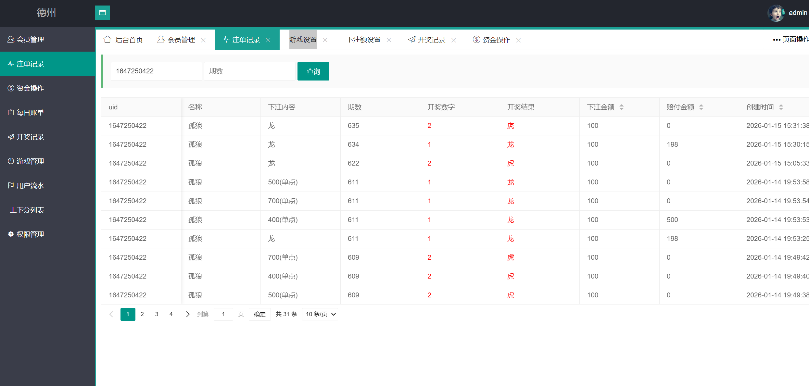
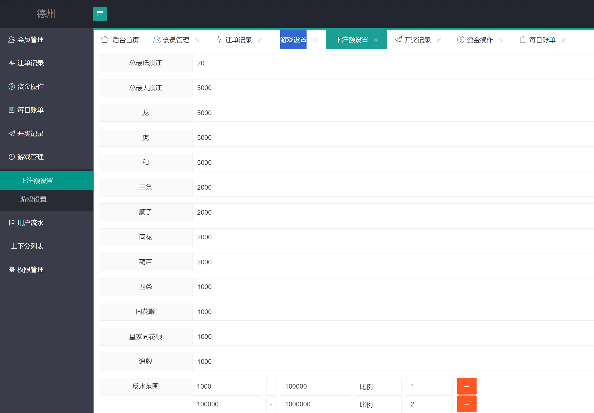
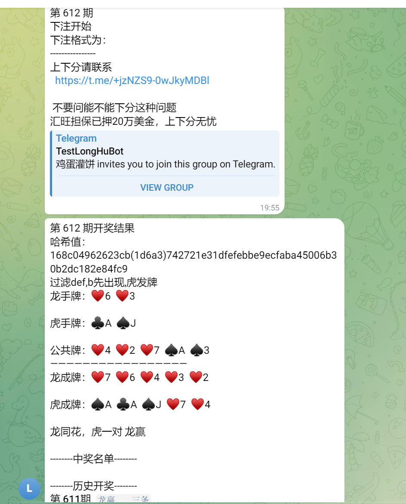
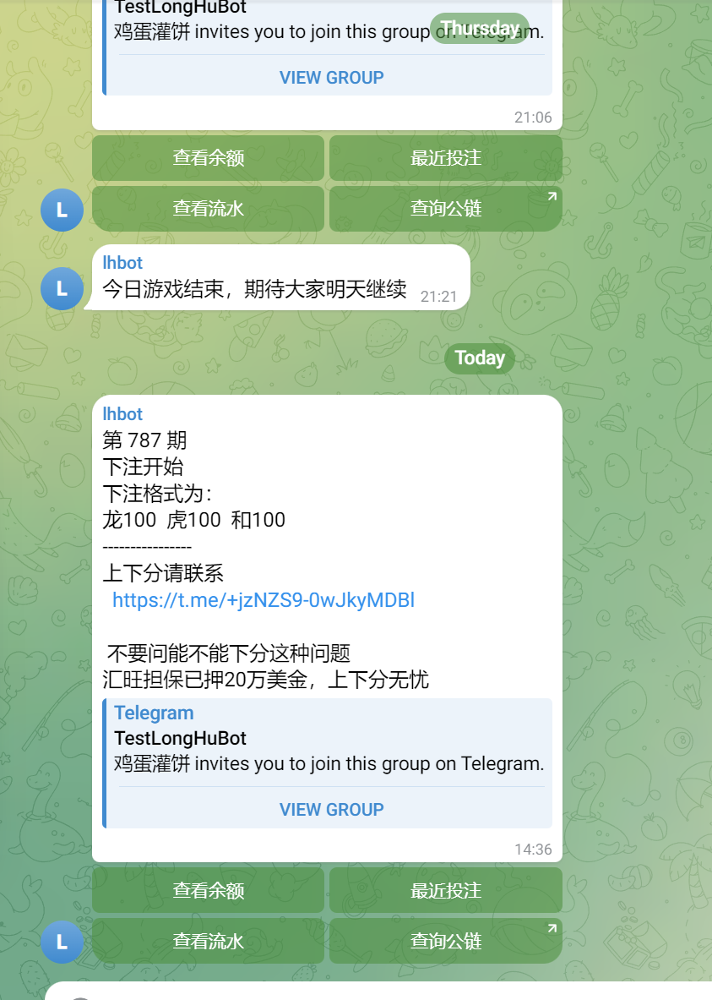
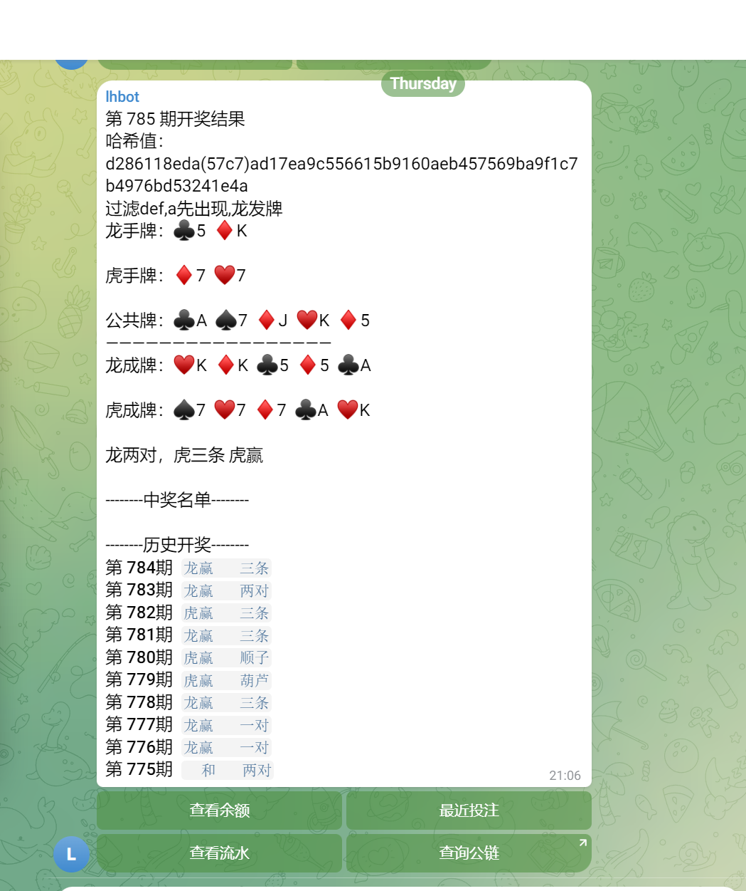

[简体中文](README.md) | **繁體中文** | [English](README.en.md)

# Telegram 德州與 H5 Web 撲克遊戲平台原始碼

这是一个面向 **Telegram 群組与 H5 Web** 场景的多人撲克交互平台项目。现有產品资料展示 TG Bot 群内交互、龍虎德州快节奏玩法、Hash 結果驗證、餘額和投注記錄、自動派彩、多群組支援与營運後台；技術說明涉及 PHP、Telegram Bot API、MySQL 和 Redis。

> 重要：目前公开倉庫只包含少量程式碼檔案与三语說明，并不是 README 所描述完整商业系统的全部交付物。完整 PHP 后端、Bot、資料庫腳本、後台和部署资料是否提供，应以实际授权与交付清单为准。本 README 不再提供无法由目前目录驗證的启动命令。

## 真实產品截图

| 營運後台 | 後台資料頁面 |
|---|---|
|  |  |

| Telegram 群内交互 | 投注界面 | 開獎結果 |
|---|---|---|
|  |  |  |

## 產品功能

- **Telegram Bot 集成**：產品资料展示在 Telegram 群内完成指令交互、投注、查詢和結果通知，减少跳转步骤。
- **H5 Web 入口**：適配手机浏览器访问，为 Telegram 内置浏览器或普通 Web 场景提供頁面入口。
- **龍虎德州玩法**：README 明确說明快节奏投注与持续开奖；具体牌型、赔率和结算规则应以完整產品配置为准。
- **Hash 結果驗證**：產品资料描述以 Hash 机制辅助核对開獎結果；上線前仍需独立审计隨機源、种子披露与驗證流程。
- **帳戶与記錄**：包括餘額查詢、投注記錄、結果通知、自動派彩和提现相关產品流程。
- **多群組与後台**：面向多个 Telegram 群的管理场景，截图展示營運後台与資料视图。
- **多人撲克扩展**：线上說明还列出 Texas Hold'em、赛事、俱乐部和多人桌方向，但目前公开程式碼不足以驗證完整實作。

## 玩家使用流程

1. 玩家在 Telegram 群中打开 Bot 或 H5 頁面。
2. 查看玩法、餘額及当期状态，选择龍虎德州等入口。
3. 通过 Bot 指令或 H5 界面提交操作。
4. 系统生成結果并在群組或頁面中通知，同时写入記錄。
5. 玩家可查詢投注历史与 Hash 驗證信息；具体资金流程需按当地法律与完整系统配置执行。

## 技術架构与目前程式碼

| 层级 | 產品资料描述 | 目前倉庫可驗證内容 |
|---|---|---|
| Web/服务层 | PHP、H5 Web | Composer 自動加载檔案、Laravel 风格 `CreatesApplication.php` 与 `TestCase.php` |
| Bot | Telegram Bot API | README 產品說明；完整 Bot 目录未在目前公开快照中出现 |
| 資料层 | MySQL、Redis | README 技術說明；資料庫腳本需以完整交付物为准 |
| 游戏逻辑 | 多人交互、龍虎德州、結果驗證 | `context.h`、`user.cpp` 等可见程式碼样本 |
| 營運层 | 多群管理、記錄、後台 | 真实產品截图；完整後台程式碼需另行核对 |

目前目录中的 `autoload_namespaces.php`、`autoload_psr4.php`、`autoload_real.php` 表明项目使用 Composer 自動加载結構；`CreatesApplication.php` 与 `TestCase.php` 显示 PHP 应用测试入口；`context.h` 和 `user.cpp` 是公开的程式碼样本。評估或部署前应索取完整目录結構、依赖版本、資料庫迁移、环境变量示例和部署文档。

## 图文专题

- [Telegram 德州原始碼与 TG Bot 產品流程](https://masterai-top.github.io/Poker-Game-Platform-Source-Code/zh-cn/telegram-poker-source-code.html)
- [H5 德州与 Web 撲克平台](https://masterai-top.github.io/Poker-Game-Platform-Source-Code/zh-cn/h5-web-poker.html)
- [龍虎德州玩法与 Hash 驗證](https://masterai-top.github.io/Poker-Game-Platform-Source-Code/zh-cn/dragon-tiger-texas.html)
- [Telegram Poker Bot 技術結構](https://masterai-top.github.io/Poker-Game-Platform-Source-Code/zh-cn/telegram-poker-bot.html)
- [English product overview](https://masterai-top.github.io/Poker-Game-Platform-Source-Code/en/telegram-poker-source-code.html)

## 取得与評估

```bash
git clone https://github.com/masterai-top/Poker-Game-Platform-Source-Code.git
cd Poker-Game-Platform-Source-Code
```

克隆命令只用于查看目前公开檔案，不代表已经获得完整可运行平台。評估时建议依次核对：交付清单、安装文档、依赖与資料庫、Bot 權限、Hash 驗證方法、後台權限、日誌审计、安全策略和合法營運范围。

## 合规与安全

涉及投注、资金、提现或类似功能的软件可能受到当地游戏、支付、反洗钱、年龄限制、隐私和消费者保护法规约束。部署前必须取得适当法律意见和许可，并完成帳戶、密钥、隨機性、支付、日誌、權限和資料保护审计。严禁用于违法活动。

聯絡：Telegram `@xuzongbin001` · Email `masterai918@gmail.com` · [GitHub Issues](https://github.com/masterai-top/Poker-Game-Platform-Source-Code/issues)
